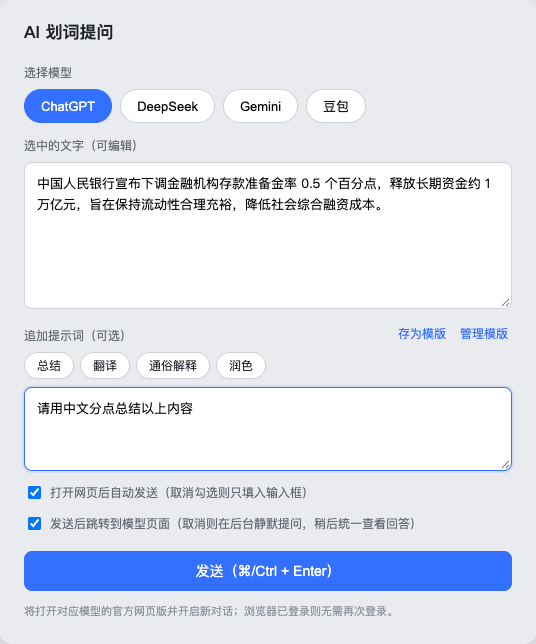
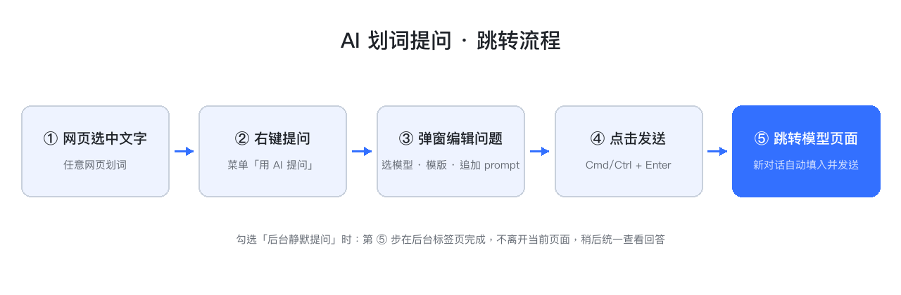

# AI 划词提问助手（浏览器插件）

在任意网页选中一段文字 → 右键「用 AI 提问」→ 在弹出窗口中选择模型、追加提示词（可用模版）→ 点击发送，自动打开对应大模型的官方网页版、**开启全新对话**并填入问题。因为使用的是各家官方网页版，**只要浏览器已登录对应账号就无需重复登录**。

目前内置模型：ChatGPT、DeepSeek、Gemini、豆包。



## 使用流程



1. 网页中选中一段文字
2. 右键 → 「用 AI 提问」
3. 弹出小窗：
   - **选择模型**（ChatGPT / DeepSeek / Gemini / 豆包，默认记住上次选择）
   - 选中的文字可继续编辑
   - 「追加提示词」可直接输入，也可点击**模版标签**插入——模版全部平铺展示，最近使用和高频使用的自动排在前面（标签右侧显示使用次数）
   - 「存为模版」：把当前提示词保存为模版（**名称重复时会提示修改名称**）
   - 「管理模版」：打开管理页，可批量修改模版标题和内容、新建、删除
   - 默认勾选「打开网页后自动发送」，取消则只填入输入框
   - 默认勾选「发送后跳转到模型页面」，取消则**在后台静默打开标签页并自动提问**——可连续发起多个提问（支持同一/不同模型，按顺序逐个填充），稍后统一切过去查看回答
4. 点击「发送」（或按 ⌘/Ctrl + Enter）→ 自动打开新标签页，新对话中填入完整问题

## 本地数据保存（插件目录之外）

- **提示词模版**与**提问记录**默认保存在浏览器扩展存储中（不在插件目录内）。
- 在「管理模版」页点击「选择目录」，可指定一个**本地文件夹**（如 `~/Documents/ai-ask-data`），之后每次数据变更都会自动同步两个文件到该目录：
  - `prompt-templates.json` — 全部提示词模版
  - `ask-history.json` — 提问记录（最近 500 条）
- 数据变更时自动写入；页面打开时若磁盘文件较新会自动合并回插件。
- 管理页还提供「导出 JSON / 导入 JSON」作为手动备份手段（也兼容不支持目录选择的环境）。

## 安装（Chrome / Edge）

1. 打开 `chrome://extensions/`（Edge 为 `edge://extensions/`）
2. 打开右上角「开发者模式」
3. 点击「加载已解压的扩展程序」，选择本目录 `ai-ask-extension`
4. 首次使用某个模型前，请先在浏览器中登录该模型官网
5. 插件代码更新后，在扩展管理页点击该插件的「刷新」按钮即可生效

## 文件结构

```
ai-ask-extension/
├── manifest.json        # MV3 清单（权限、域名、content script 注册）
├── models.js            # 模型配置中心（新增模型改这里）
├── background.js        # 右键菜单注册、弹起 compose 窗口
├── compose.html/.js/.css    # 提问小窗（选模型、模版、追加 prompt、发送）
├── manage.html/.js/.css     # 管理页（模版增删改、数据目录、提问记录）
├── lib/store.js         # 存储层：chrome.storage.local + 本地目录同步
├── content/fill.js      # 注入各模型官网，负责填入输入框 + 自动发送
└── icons/               # 插件图标
```

## 添加新模型

1. 在 `models.js` 中新增一项（名称、新对话 URL、host）
2. 在 `manifest.json` 的 `host_permissions` 和 `content_scripts.matches` 中加入对应域名
3. 在 `content/fill.js` 的 `SITE_CONFIG` 中补充该站点的输入框 / 发送按钮选择器

## 实现说明与注意事项

- **每次新对话**：直接打开各模型的裸新对话入口（如 `https://chatgpt.com/`），不带会话 ID。
- **登录态**：完全复用浏览器 Cookie，插件不接触任何账号密码。
- **填充机制**：弹窗把问题通过消息发给后台服务线程，由后台在「正常窗口」中打开模型页面（避免标签页开进 popup 小窗后随窗口关闭）；新标签页中的 content script 通过消息通道向后台取走问题文本（回退方案为 `storage.session`），轮询等待输入框渲染后填入；textarea 用原生赋值 + input 事件，富文本（ChatGPT ProseMirror、Gemini Quill）用 `execCommand('insertText')` 注入。填充过程会在页面 Console 输出 `[AI划词]` 前缀的调试日志。
- **自动发送**：优先点击各站点的发送按钮，找不到则回退为派发 Enter 键。
- **本地目录同步**：基于 File System Access API（`showDirectoryPicker`），目录句柄保存在 IndexedDB 中跨会话复用；浏览器出于安全考虑可能要求重新授权，到管理页重新选择即可。
- **已知限制**：
  - 各模型官网 DOM 结构可能随版本更新变化，若填充失效需更新 `content/fill.js` 中的选择器。
  - 连续快速发起多次提问时，只有最新一次会被自动填充（单槽位设计）。
